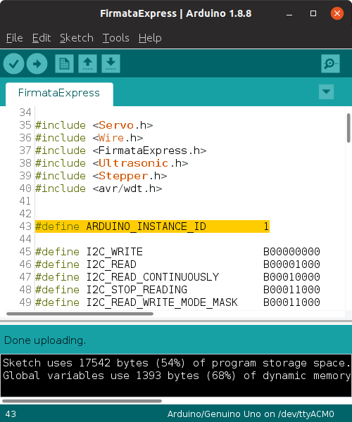

# Installation Instruction


<p>1. Open the Arduino IDE and select Tools/Manage Libraries.</p>


<p>2. Enter "FirmataExpress in the search box.</p>


<p>3. Click on the Install button.</p>


<p> 4. FirmataExpress also requires that the Ultrasonic library
by Erick Simões be installed.</p>
Using the Arduino IDE, install the [ultrasonic library](https://github.com/ErickSimoes/Ultrasonic). Click on Tools/Manage Libraries
and select Ultrasonic and then click Install.


# Setting The FirmataExpress Instance ID

FirmataExpress, in conjunction with pymata4, has the ability to automatically
associate a Pymata Express application with a specific Arduino board
plugged into your computer.

If you only have a single Arduino connected at a time, you do not need to do anything. However,
if you wish to run multiple Arduinos, you will need to assign a unique ID number to each
Arduino. The ID number is then supplied as an input parameter when your application
 is instantiated.

The Pymata Express instance parameter is discussed
[here](https://mryslab.github.io/pymata-express/guidelines/#parameter-arduino_instance_id).

To set the ID number in FirmataExpress, load the FirmataExpress sketch into the Arduino IDE,
and look for the following line:

```
#define ARDUINO_INSTANCE_ID         1
```

Modify the value of 1 to the matching number you will use with Pymata Express.



You may then compile and upload FirmataExpress to your Arduino.

<br>
<br>
Copyright (C) 2019-2020 Alan Yorinks. All Rights Reserved.
